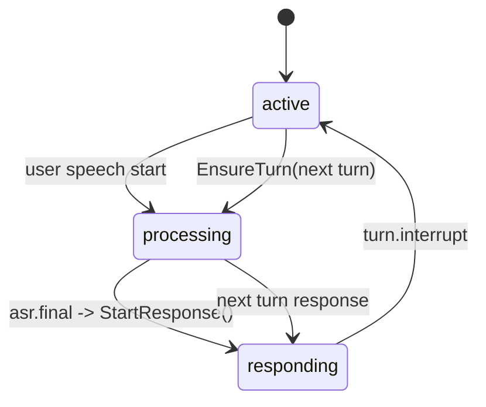
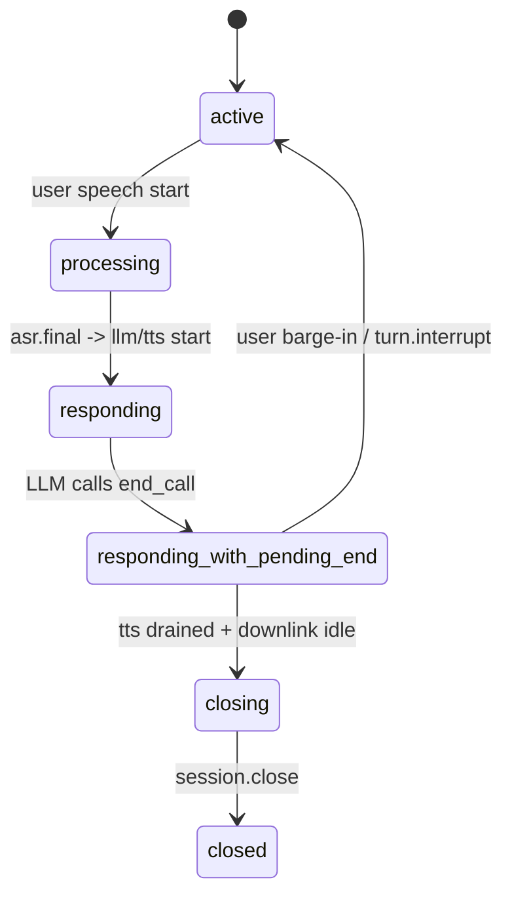

# Session State Machine

## Core Principle

中断不是 UI 辅助动作，而是高优先级系统事件。它必须能够打断当前 bot 输出、取消当前 turn 的未完成任务，并切换到新 turn。

## Session States

- `created`: session 已分配，尚未完成协商
- `negotiating`: 正在交换 SDP / ICE
- `active`: 音频链路可用，等待用户输入
- `processing`: 正在处理当前用户 turn
- `responding`: bot 正在输出语音或事件
- `responding_with_pending_end`: bot 已通过 `end_call` tool 决定本轮播完后结束通话
- `closing`: 正在结束会话
- `closed`: 已结束

补充约定：

- 接通后的 bot 开场白视为“opening turn”
- 语义上它相当于第 0 轮自我介绍，但当前内部 `turn_id` 仍沿用现有自增编号，因此通常会占用首个 turn id
- opening turn 同样遵循 `turn.started -> bot.speaking.* -> turn.completed`

## System Events

- `session.start`
- `session.ready`
- `vad.started`
- `vad.stopped`
- `turn.begin`
- `turn.interrupt_hint`
- `turn.interrupt`
- `turn.cancel`
- `turn.end_of_utterance`
- `turn.complete`
- `session.timeout`
- `session.end`

## Interrupt Rule

收到 `turn.interrupt` 时：

1. 停止当前 TTS 输出
2. 取消当前 turn 下游任务
3. 标记当前 turn 为 interrupted
4. 切换到下一 turn
5. session 返回 `active`，准备接收新的用户输入

## Interrupt Hint Rule

`turn.interrupt_hint` 可以由客户端发送，但它不是最终裁决。

bot 收到 hint 后：

1. 立即提升本会话对用户上行音频的关注级别
2. 结合服务端 VAD 和当前 bot speaking 状态做最终判断
3. 只有判定用户真实 barge-in 时，才升级为 `turn.interrupt`

## Automatic Barge-In Rule

当 session 处于 `responding`，且服务端检测到用户重新开口时，不得继续复用当前 turn。

正确流转是：

1. 服务端将当前 bot turn 标记为 interrupted
2. 立即停止当前 TTS / 下游回复任务
3. session 从 `responding` 回到 `active`
4. 立刻创建下一轮 turn，并进入 `processing`
5. 用户插话音频进入 next turn 的 ASR / LLM / TTS

如果继续把插话语音挂到旧 turn，会出现“旧回复正在收尾，而新 `asr.final` 也试图在同一个 turn 上启动回复”的冲突，最终表现为新问题无法顺利进入 LLM / TTS。

## End Of Utterance Rule

`turn.end_of_utterance` 只能由服务端产生。它表示：

- 当前用户语音段已经结束
- 可以将稳定音频片段推进 ASR finalization 或下游 LLM
- 它不是前端按钮事件

## Tool-Based End Call Rule

主动挂断不再依赖服务端对文案做关键词猜测，改为显式 tool 控制：

1. LLM 在需要结束通话时调用 `end_call`
2. tool 只写入 turn 级 `pending_end_call` 意图，不立即关闭会话
3. 当前 turn 继续完成 `llm.final -> tts.segment.* -> downlink drain`
4. 服务端在当前 bot 结束语实际播完后发出 `session.ending`
5. 短暂 grace period 后发送 signaling `session.close` 并关闭 WebRTC / session

如果 bot 已写入 `pending_end_call`，但在播完前被用户插话打断，则该 turn 被取消，挂断意图随 turn 一起失效，不进入 `closing`。

## State Constraints

- `closed` 后不可再进入其他状态
- `closing` 只允许进入 `closed`
- `responding` 可被 `turn.interrupt` 抢占并回到 `active`
- `responding_with_pending_end` 本质上仍属于响应中状态，也允许被 `turn.interrupt` 抢占
