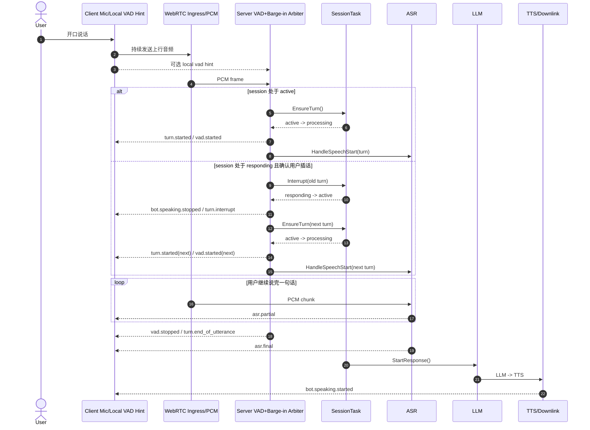

# VAD And Endpointing

## Decision

本项目采用「双层设计，服务端裁决」：

- 服务端 VAD / endpointing：必做，且为权威来源
- 客户端 VAD：可做，仅用于 UI 与 interrupt hint

## Why

- turn 切分属于 session 编排职责，不属于浏览器 UI
- interrupt、cancel、TTS stop、ASR finalization 依赖统一裁决
- provider timeout、误切分、弱网与回放调试依赖服务端事实源

## MVP Strategy

### Phase 0 / Phase 1

- 客户端持续上行音频
- bot 执行服务端 endpointing
- bot 发送 `vad.started / vad.stopped / turn.end_of_utterance`
- 客户端展示 speaking meter

当前代码状态：

- 已接入服务端 packet-activity endpointing placeholder
- 基于上行 RTP 包活动与静默超时发出事件
- 当前实现属于过渡形态，区别于最终 PCM / feature-based VAD
- 职责是先打通服务端权威 turn 切分链路
- 上行音频先进入统一的 codec-aware encoded packet ingress stream
- decoder 后的 PCM 已接入流式 ASR
- Opus 解码切换至 WASM libopus 后端，贴近浏览器 WebRTC 实流
- 下一步重点为使用真实 PCM VAD 替换 packet-activity heuristic，音频接入层保持不变

### Phase 2

- 客户端增加本地 VAD
- bot speaking 期间，客户端可发送 `turn.interrupt_hint`
- bot 基于服务端音频与 VAD 状态判定是否升级为 `turn.interrupt`

## Recommended Streaming Pipeline

1. WebRTC 上行音频持续进入 bot
2. bot 重采样 / 分帧
3. 服务端 VAD 识别语音段边界
4. 音频段推进流式 ASR
5. ASR partial 用于 UI
6. ASR stable / final 推进 LLM
7. LLM token stream 推进 TTS
8. TTS audio chunk 流式回推客户端
9. interrupt 到来时，先 cancel TTS，再取消当前轮未完成任务

## Automatic Barge-In Sequence

当 bot 正在说话时，用户再次开口的时序如下：

实现约束：

- `responding` 状态下检测到用户重新开口时，必须先切断旧 turn，再创建 next turn
- 禁止将插话语音继续记到旧 turn
- 被 interrupt 的回复链不得继续 emit `turn.completed`
- 客户端 local VAD 仅用于加速 hint，最终裁决由服务端执行

## Rules

- 客户端不得单方面认定 turn 已结束
- 客户端不得单方面认定 interrupt 已成立
- 服务端基于 VAD、bot speaking 状态、会话状态执行最终裁决
- `turn.end_of_utterance` 仅由服务端产生

## Future Work

- 用 PCM 解码后的真实 VAD 替换 packet-activity heuristic
- 语音起始点补偿，避免截掉起始音节
- endpointing 参数配置化
- 面向不同 provider 的 partial / stable 策略适配
- 双讲、回声和弱网情况下的 interrupt 调优
- 浏览器真实上行流的兼容性回归测试与 fallback 策略
